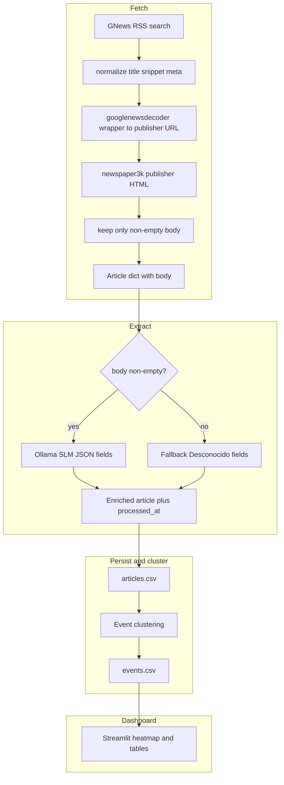

# News Analyzer — Mexico Cartel Heatmap

A local pipeline that fetches Google News, **decodes each `news.google.com` link**, downloads full article text with **newspaper3k**, and **returns only items where the body was successfully retrieved** (up to `MAX_ARTICLES`). It runs a Small Language Model (Ollama) on those rows, extracts structured fields, clusters events, and renders an interactive state-level heatmap in Streamlit.

## Architecture

End-to-end flow:



Legacy one-liner summary:

```
gnews search → full text only → SLM → CSV → clustering → Streamlit
```

## Prerequisites

1. **Ollama** — install from https://ollama.com, then pull the default model:
   ```bash
   ollama pull llama3.2:3b
   ```

2. **Conda environment** (recommended — works with Miniconda/Anaconda):
   ```bash
   conda create -n news-analyzer python=3.11 -y
   conda activate news-analyzer
   pip install -r requirements.txt
   ```

   Or with plain venv:
   ```bash
   python3.11 -m venv .venv
   source .venv/bin/activate
   pip install -r requirements.txt
   ```

## Running

```bash
conda activate news-analyzer
streamlit run src/dashboard.py --server.address 127.0.0.1
```

Then open **http://127.0.0.1:8501** (not only `localhost`) so the browser and server agree on IPv4; a fully white page is often a stale tab, a zombie process on port 8501, or `localhost` resolving to IPv6 while the server listens on IPv4.

**If the page stays blank:** free the port (`lsof -ti:8501 | xargs kill -9`), close old tabs, try a fresh incognito window, and capture logs with:

```bash
streamlit run src/dashboard.py --server.headless=true --server.address 127.0.0.1 2>&1 | tee /tmp/streamlit.log
```

Watch the terminal for a Python traceback when you load the page. Optional: `pip install watchdog` inside the conda env (Streamlit suggests this on macOS for faster reloads).

The dashboard has a **Refresh** button that fetches candidates from Google News, keeps only rows with full text, runs the SLM, and updates the map.

## Configuration

Edit `config.py` to change:
- `MODEL_NAME` — Ollama model (e.g. `"llama3.2:3b"`, `"phi3:mini"`, `"gemma3:4b"`)
- `LOOKBACK_DAYS` — how many days back to fetch news
- `MAX_ARTICLES` — target count of articles **with downloadable full text** per Refresh run
- `GNEWS_RSS_MAX_ITEMS` — max RSS entries to scan from Google News (must be ≥ `MAX_ARTICLES`; increase if many hits lack body)
- `ARTICLE_BODY_MAX_CHARS_SLM` — max characters of article body stored and sent to the SLM
- `GOOGLE_NEWS_DECODE_INTERVAL_SEC` — optional delay between Google News URL decodes (rate limits)
- `ARTICLE_FETCH_TIMEOUT_SEC` / `ARTICLE_FETCH_USER_AGENT` — newspaper3k HTTP behavior (some sites 403 generic bots)
- `FETCH_QUERY_TERMS` — terms used to build the Google News query (joined with OR; multi-word terms auto-quoted)

## Fetch limitations

Many publishers (including some **EL PAÍS** pages) return **HTTP 403** for automated HTTP clients. That is usually **bot / WAF filtering**, not a classic paywall (paywalls often still return **200** with partial HTML). **Facebook / Instagram / YouTube** links are **not normal article pages**; those RSS rows are skipped.

The Refresh pipeline **only appends** articles that got a non-empty `body`. Older CSV rows without a body (from previous versions) may still exist; clustering treats them separately from fully extracted stories.

## Output

The dashboard shows:
- **Choropleth map** of Mexico colored by incident count per state, with one color per criminal group
- **Sidebar filters**: date range, group, crime type
- **Article table** with title, extracted state/municipality, group, and crime type

## Tests

```bash
pip install -r requirements-dev.txt
pytest                # fast unit tests only
pytest --live         # also runs the live Google News statistical test
```

The `--live` test asserts that at least 90% of fetched articles are both crime-relevant and Mexico-relevant.
